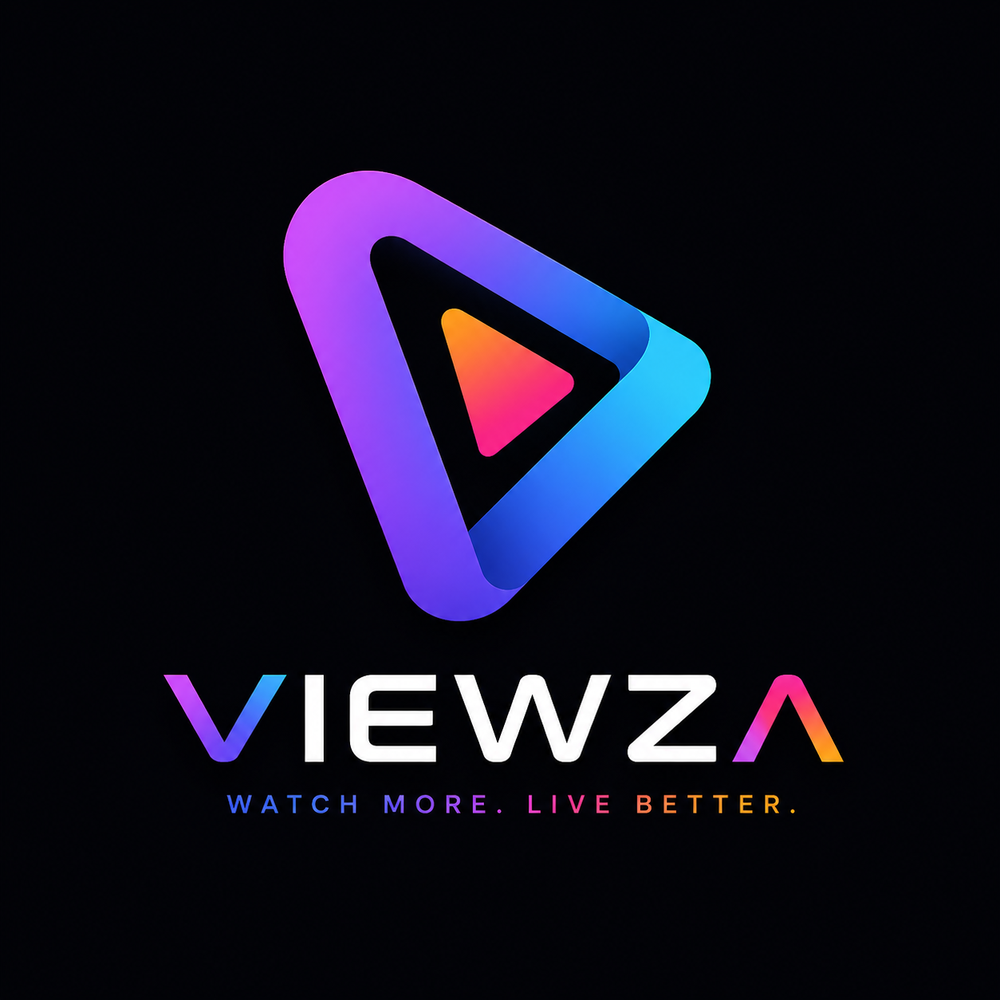
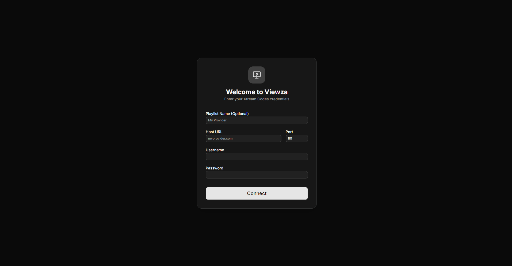
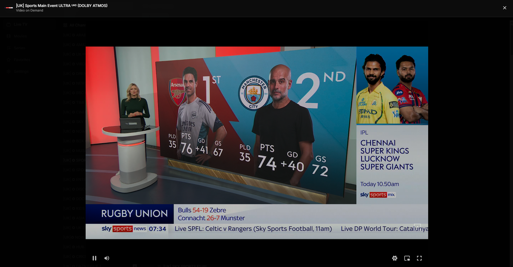
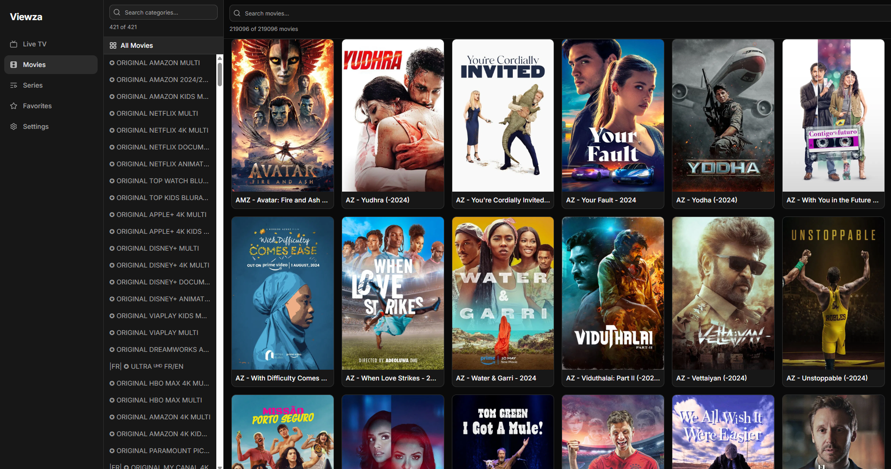
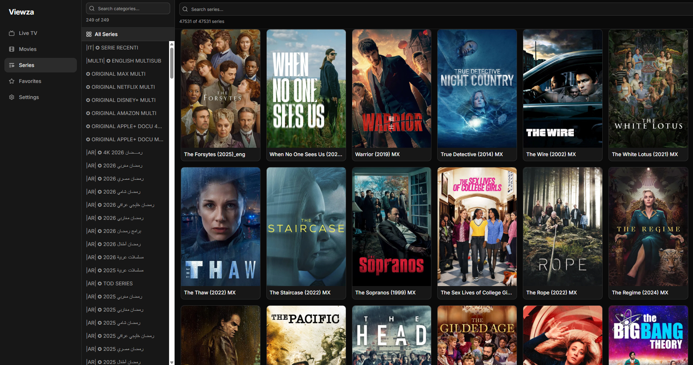
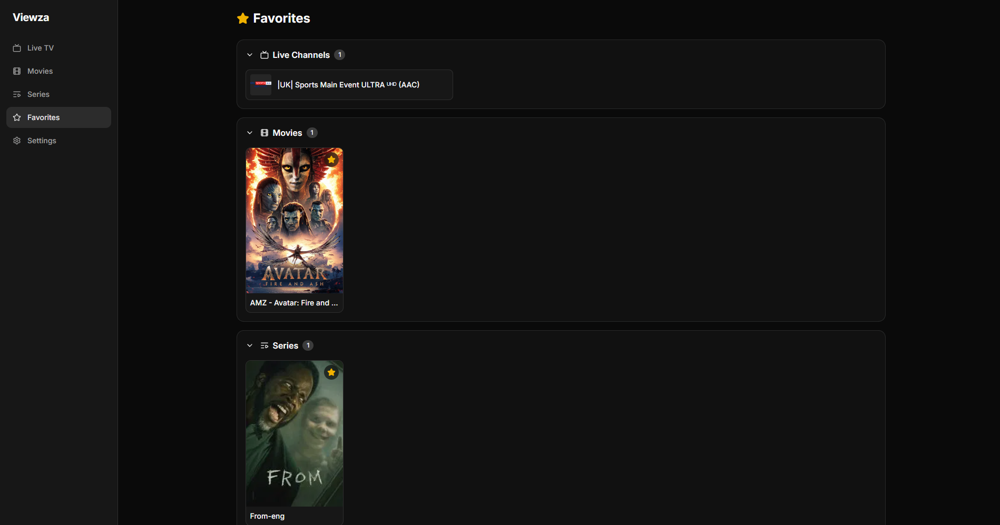
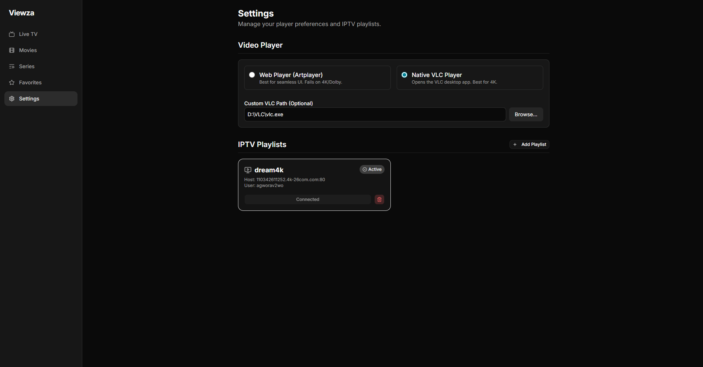

# <p align="center">Viewza</p>

<p align="center">
  
</p>

<p align="center">
  Modern IPTV desktop streaming application built with <strong>Tauri</strong>, <strong>React</strong>, and <strong>TypeScript</strong>.
</p>

<p align="center">
  Lightweight • Fast • Native • Modern UI
</p>

---

# ✨ Features

* 📺 Live TV streaming
* 🎬 Movies library
* 📼 TV Series support
* ⭐ Favorites system
* ⚡ Fast native desktop performance with Tauri
* 🎨 Modern dark UI
* 🔎 Category & content search
* 🖥️ VLC integration support
* 📦 Lightweight desktop application
* ❤️ Cross-platform architecture

---

# 🖼️ Screenshots

## Landing Page



---

## Live TV


---

## Video Player



---

## Movies



---

## Series



---

## Favorites



---

## Settings



---

# 🛠️ Tech Stack

* React
* TypeScript
* Vite
* Tauri
* TailwindCSS
* VLC Integration

---

# 📥 Installation

## Windows

1. Download the latest `.exe` installer from the Releases page
2. Run the installer
3. Launch Viewza

## macOS

macOS builds are not currently distributed officially.

However, developers can run the project locally using:

```bash
npm install
npm run tauri dev
```

To build for macOS:

```bash
npm run tauri build
```

A macOS machine is required to generate `.app` or `.dmg` builds.

## Linux

Linux support is experimental and may require additional dependencies depending on the distribution.


---

# 🚀 Development Setup

```bash
npm install
npm run tauri dev
```

# 📦 Build

```bash
npm run tauri build
```

---

# 📁 Project Structure

```bash
src/
├── components/
├── pages/
├── hooks/
├── lib/
└── styles/

src-tauri/
├── icons/
├── src/
└── tauri.conf.json
```

---

# 📌 Notes

This project was built as a fast MVP focused on creating a clean IPTV desktop experience with modern technologies and native performance.

The project is actively evolving and more features are planned in future updates.

---

# 📄 License

MIT License © 2026 Imadeddine Belkat

---

# ❤️ Author

Made with ❤️ by Imadeddine Belkat

---

# ⚠️ Disclaimer

Viewza is only a media player application and does not provide, host, distribute, or include any IPTV playlists, channels, streams, or copyrighted content.

Users are responsible for supplying their own legally obtained IPTV services and media sources.

The developer of Viewza does not endorse or encourage piracy or unauthorized streaming of copyrighted material.

---
